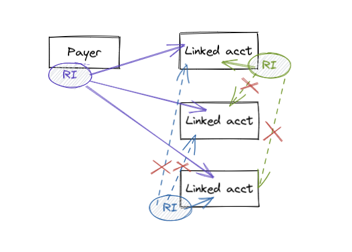
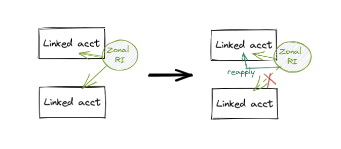
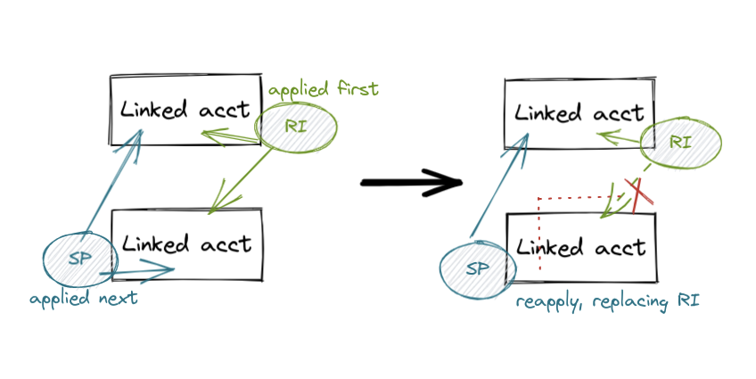

# About our TrueUnblended calculations for AWS

!!! warning
    TrueUnblended only applies to your [AWS](https://aws.amazon.com/) cost calculations.

In [AWS consolidated billing](https://docs.aws.amazon.com/awsaccountbilling/latest/aboutv2/consolidated-billing.html), unless configured otherwise, all the usages of all member accounts of an organization, including the payer, are combined in order to share volume discounts, and RI/SP discounts. This is beneficial from a cloud reseller and an enterprise CCOE's point of view as they can share RI/SP discounts purchased at the payer level across the organization.

<figure markdown>
  
</figure>

However, from a client's perspective, 

<figure markdown>
  
</figure>

TrueUnblended point #2

<figure markdown>
  
</figure>

TrueUnblended point #3

<figure markdown>
  
</figure>
